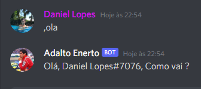

# Bot Para Discord em Python

##
Bot Basico para o discord, desenvolvido em Python

##
Para esse bot funcionar, voce precisa entrar no portal de desenvolvedor do discord e criar seu bot 
https://discord.com/developers/applications
